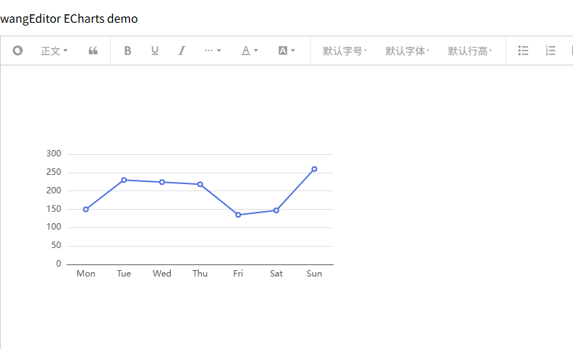

# wangEditor ECharts

[English Documentation](./README-en.md)

## 介绍

[wangEditor](https://www.wangeditor.com/) ECharts插件，使用 [Apache ECharts](https://echarts.apache.org/) 。



## 安装

```shell
yarn add echarts
yarn add wangeditor-plugin-echarts
```

## 使用

### 注册到编辑器

```js
import { Boot, IEditorConfig, IToolbarConfig } from '@wangeditor/editor'
import echartsModule from 'wangeditor-plugin-echarts

// 注册。要在创建编辑器之前注册，且只能注册一次，不可重复注册。
Boot.registerModule(echartsModule)
```

### 配置

```js
// 编辑器配置
const editorConfig: Partial<IEditorConfig> = {
  // 选中ECharts时的悬浮菜单
  hoverbarKeys: {
    echarts: {
      menuKeys: ['editEcharts'], // “编辑ECharts”菜单
    },
  },

  // 其他...
}

// 工具栏配置
const toolbarConfig: Partial<IToolbarConfig> = {
  insertKeys: {
    index: 0,
    keys: [
      'insertECharts', // “插入ECharts”菜单
      // 'editECharts' // “编辑ECharts”菜单
    ],
  },

  // 其他...
}
```

然后创建编辑器和工具栏，会用到 `editorConfig` 和 `toolbarConfig` 。具体查看 wangEditor 文档。

### 显示 HTML

ECharts获取的 HTML 格式如下

```html
<span data-w-e-type="echarts" data-w-e-is-void data-w-e-is-inline data-value="
    {
      xAxis: {
        type: 'category',
        data: ['Mon', 'Tue', 'Wed', 'Thu', 'Fri', 'Sat', 'Sun']
      },
      yAxis: {
        type: 'value'
      },
      series: [
        {
          data: [150, 230, 224, 218, 135, 147, 260],
          type: 'line'
        }
      ]
    }
  " data-height="300" data-width="500"></span>
```

其中 `data-value` 就是 ECharts 图表参数，可使用 [Apache ECharts](https://echarts.apache.org/) 把 `<span>` 渲染成ECharts卡片；`data-height` 是图表的高度，`data-width` 是图表的宽度。

## 其他

支持 i18n 多语言

## 鸣谢

感谢以下组织或个人的支持：

- [wangEditor Team](https://github.com/wangeditor-team)
- [Apache ECharts](https://github.com/apache/echarts)
